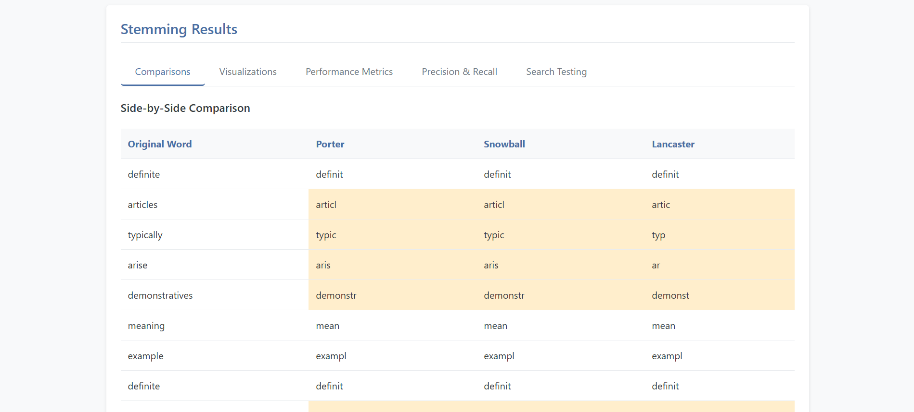

# Stemming Algorithm Performance Comparison

This interactive web application compares the performance and effectiveness of three popular stemming algorithms (Porter, Snowball, and Lancaster) in information retrieval systems. It provides visualizations, metrics, and search testing capabilities to help understand the differences between these algorithms.



## Features

- **Side-by-Side Comparison**: Direct comparison of how each stemmer processes the same text
- **Performance Metrics**: Accuracy, vocabulary reduction, processing time, and more
- **Precision & Recall Analysis**: Detailed evaluation of each stemmer's precision, recall, and F1 scores
- **Search Testing**: Test how different stemmers affect search relevance
- **Interactive Visualizations**: Charts for easy comparison and analysis
- **Dynamic Analysis**: All metrics update based on your own input text

## Requirements

- Python 3.6+
- Flask
- NLTK
- scikit-learn
- pandas

## Installation

### 1. Clone the repository

```bash
git clone https://github.com/yourusername/stemming-algorithm-comparison.git
cd stemming-algorithm-comparison
```

### 2. Set up a virtual environment (recommended)

#### For Windows:
```bash
python -m venv venv
venv\Scripts\activate
```

#### For macOS/Linux:
```bash
python3 -m venv venv
source venv/bin/activate
```

### 3. Install dependencies

```bash
pip install -r requirements.txt
```

If the requirements.txt file is missing, create it with the following content:

```
flask==2.0.1
nltk==3.6.2
scikit-learn==0.24.2
pandas==1.3.0
```

Or install packages individually:

```bash
pip install flask nltk scikit-learn pandas
```

### 4. Download NLTK data

In a Python terminal or script:

```python
import nltk
nltk.download('punkt')
nltk.download('stopwords')
```

## Running the Application

1. Start the Flask application:

```bash
python app.py
```

2. Open a web browser and go to:

```
http://127.0.0.1:5000/
```

## How to Use

1. **Enter Text to Analyze**: 
   - Input your text in the textarea provided
   - Click "Compare All Stemmers" to analyze with all three algorithms

2. **View Comparison Results**:
   - Check the side-by-side table showing how each stemmer processes each word
   - Differences are highlighted for easy identification

3. **Explore Visualizations**:
   - View charts for vocabulary reduction, processing time, etc.
   - All visualizations are based on your input text

4. **Check Performance Metrics**:
   - See accuracy, precision, recall, and F1 scores for each stemmer
   - Overstemming and understemming errors are quantified

5. **Test Search Functionality**:
   - Enter search queries to see how different stemmers affect results
   - The search corpus is created from your input text

## Understanding the Metrics

- **Accuracy**: How well the stemmer matches expected stems
- **Vocabulary Reduction**: Percentage reduction in unique terms after stemming
- **Precision**: The stemmer's ability to avoid combining unrelated words
- **Recall**: The stemmer's ability to group related word forms
- **F1 Score**: Harmonic mean of precision and recall
- **Overstemming**: When different words are incorrectly reduced to the same stem
- **Understemming**: When variations of the same word are stemmed differently

## Project Structure

```
stemming-algorithm-comparison/
├── app.py                  # Flask application and backend logic
├── requirements.txt        # Python dependencies
├── README.md               # Project documentation
├── static/                 # Static assets
│   ├── css/
│   │   └── style.css       # CSS styles
│   └── js/
│       └── script.js       # Frontend JavaScript
└── templates/
    └── index.html          # HTML template
```

## Troubleshooting

- **NLTK Data Error**: If you encounter NLTK resource errors, ensure you've downloaded the required data packages
- **Flask Application Error**: Make sure all dependencies are installed correctly
- **Visualization Issues**: Ensure Chart.js is properly loaded (check your internet connection)

## Contribution

Contributions are welcome! Please feel free to submit a Pull Request.

## Acknowledgments

- The Porter Stemming Algorithm by Martin Porter
- The Snowball Stemming Algorithm (Porter2)
- The Lancaster Stemming Algorithm by Paice/Husk
- NLTK library and its developers for implementations 
